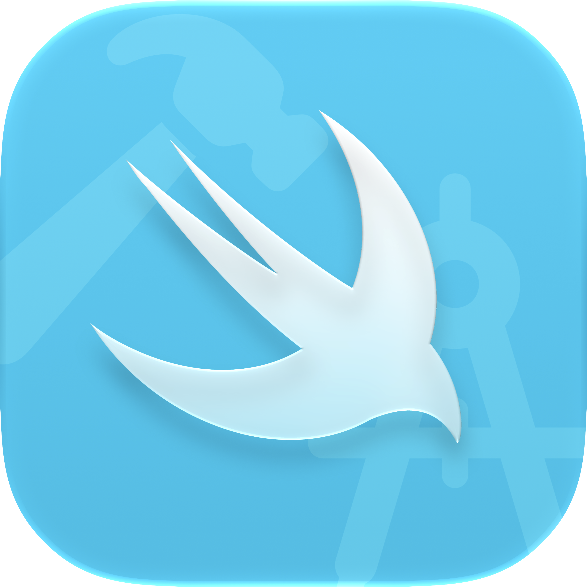

<p align="center">

</p>

# SwiftViewModel

### View models with SwiftUI environment and structured asynchronous work

<p>
  <a href="https://github.com/ricocrescenzio95/SwiftViewModel/actions/workflows/tests.yml"></a>
  <a href="https://github.com/ricocrescenzio95/SwiftViewModel/releases"></a>
  <a href="https://swiftpackageindex.com/ricocrescenzio95/SwiftViewModel"></a>
  <a href="https://swiftpackageindex.com/ricocrescenzio95/SwiftViewModel"></a>
  <a href="https://saythanks.io/to/rico.crescenzio"></a>
  <a href="https://www.paypal.com/donate/?hosted_button_id=RWDBC8TS5CNVA"></a>
</p>

## Why SwiftViewModel?

SwiftUI makes it easy to keep state in a view, but view-specific behavior, environment-dependent setup, and asynchronous work can quickly make views difficult to read and test.

SwiftViewModel keeps that logic in reference-type view models while preserving SwiftUI's environment and observation model:

- **Environment access** — view models receive the current `EnvironmentValues` from their owning view.
- **Stable ownership** — `ViewModelObject` keeps a model alive for the lifetime of the view identity, like `StateObject`.
- **Testable setup** — `TestViewModelObject` installs explicit environment values without mounting a view.
- **Managed asynchronous work** — tasks are tracked, replaced by identifier, and cancelled with the view model by default.

## Features

- **`ViewModel` protocol** — define reference-type models that react to their SwiftUI environment
- **`ViewModelObject`** — create and own a view model from a SwiftUI view
- **`TestViewModelObject`** — prepare view models with explicit environment values in tests
- **Environment lifecycle callback** — run setup once with `onEnvironmentReady()`
- **Throwing and nonthrowing tasks** — start async work directly from a view model
- **Task replacement** — a task with the same identifier cancels the previous one
- **Automatic cancellation** — tasks are cancelled when their view model storage is released
- **Optional task lifetime** — use `keepAlive` when a task should outlive the storage
- **Runtime diagnostics** — warn in debug builds when the environment is read too early
- **Swift Package Manager** — supports macOS 14+, iOS 17+, watchOS 10+, and tvOS 17+

## Installation

`SwiftViewModel` can be installed using Swift Package Manager.

1. In Xcode open **File/Swift Packages/Add Package Dependency...** menu.
2. Copy and paste the package URL:

```
https://github.com/ricocrescenzio95/SwiftViewModel
```

For more details refer to [Adding Package Dependencies to Your App](https://developer.apple.com/documentation/xcode/adding-package-dependencies-to-your-app) documentation.

## Usage

### Define a View Model

Conform a reference type to `ViewModel`. The model can read the environment after SwiftViewModel has installed it:

```swift
import Observation
import SwiftUI
import SwiftViewModel

@MainActor
@Observable
final class GreetingViewModel: ViewModel {
    private(set) var greeting = "Hello"

    func onEnvironmentReady() {
        if environment.locale.language.languageCode?.identifier == "it" {
            greeting = "Ciao"
        }
    }
}
```

### Use a View Model in SwiftUI

Use `ViewModelObject` when a view creates and owns its model:

```swift
struct GreetingView: View {
    @ViewModelObject private var viewModel = GreetingViewModel()

    var body: some View {
        Text(viewModel.greeting)
    }
}
```

The wrapper updates the model's environment before the view body is evaluated and calls `onEnvironmentReady()` once.

### Start Asynchronous Work

Use `task` for nonthrowing or throwing work. A task with the same identifier replaces the previous task:

```swift
func loadGreeting() {
    task(id: "load-greeting") {
        try? await Task.sleep(for: .milliseconds(250))
        greeting = "Loaded"
    }
}
```

Tasks are cancelled automatically when the view model storage is released. Pass `keepAlive: true` when the operation must continue after that point.

### Test View Models

Use `TestViewModelObject` to install environment values without rendering a view:

```swift
import SwiftUI
import SwiftViewModel
import Testing

@Test
@MainActor
func readsLocaleFromEnvironment() {
    var environment = EnvironmentValues()
    environment.locale = Locale(identifier: "it_IT")

    @TestViewModelObject(environment: environment)
    var viewModel = GreetingViewModel()

    #expect(viewModel.greeting == "Ciao")
}
```

### Wait for View Model Tasks

`waitViewModelTasks` waits until all view model tasks created during the operation have completed:

```swift
@Test
@MainActor
func loadsGreeting() async {
    @TestViewModelObject
    var viewModel = GreetingViewModel()

    await waitViewModelTasks {
        viewModel.loadGreeting()
    }

    #expect(viewModel.greeting == "Loaded")
}
```

For advanced usages, please refer to the full Documentation.

## Limitations

- **The environment is not available in `init`.** Reading `environment` before `ViewModelObject` or `TestViewModelObject` installs it returns default values and emits a runtime warning in debug builds. Use `onEnvironmentReady()` for environment-dependent setup.
- **View models must be reference types.** `ViewModel` is class-constrained so SwiftViewModel can associate storage with a stable object identity.
- **`keepAlive` does not retain the view model.** A task can outlive the storage, but it does not keep the view model, its environment, or its dependencies alive.

## Documentation

Use Apple `DocC` generated documentation, from Xcode, **Product > Build Documentation**.

## Found a bug or want new feature?

If you found a bug, you can open an issue as a bug [here](https://github.com/ricocrescenzio95/SwiftViewModel/issues/new?assignees=ricocrescenzio95&labels=bug&template=bug_report.md&title=%5BBUG%5D)
